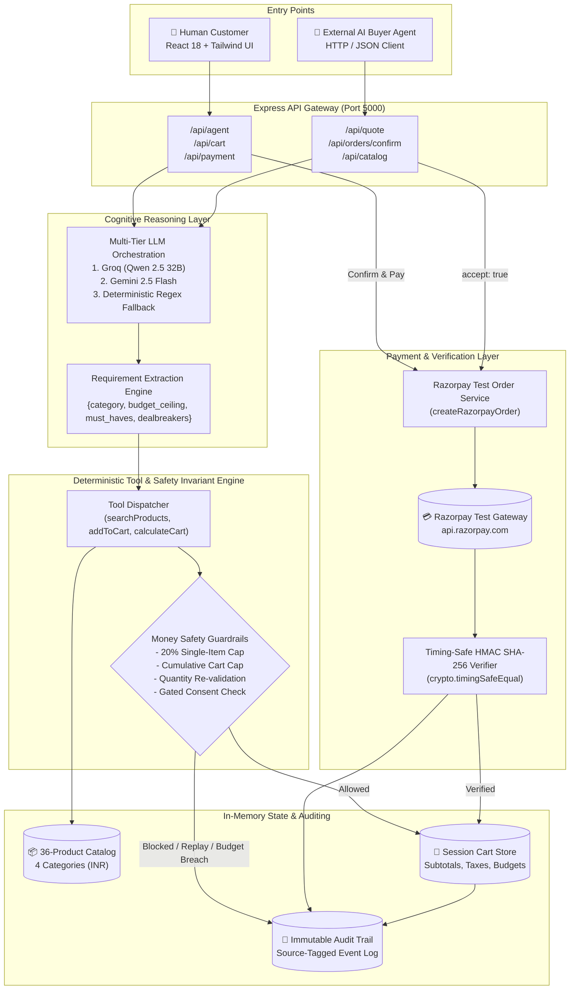

# Razorpay AI Revenue Maximizer 🚀
### Track 01: AI Growth & Agentic Commerce | Razorpay AI Buildathon 2026

[](https://razorpay.com)
[](#-hardened-money-action-guardrails-judging-bar)
[](file:///d:/Razor/backend/src/routes/agentApiRoutes.js)
[](LICENSE)

---

## 📑 Table of Contents
- [Executive Summary](#-executive-summary)
- [Why It Matters for Razorpay & E-Commerce](#-why-it-matters-for-razorpay--e-commerce)
- [Hardened Money-Action Guardrails (Judging Bar)](#-hardened-money-action-guardrails-judging-bar)
- [Architecture & System Flow](#-architecture--system-flow)
- [Agent-to-Agent (A2A) Commerce Protocol](#-agent-to-agent-a2a-commerce-protocol)
- [Interactive Merchant Dashboard & Live Audit Trail](#-interactive-merchant-dashboard--live-audit-trail)
- [Definition of Done (DoD) Compliance Matrix](#-definition-of-done-dod-compliance-matrix)
- [7 Server-Hardened Edge Cases & Invariants](#-7-server-hardened-edge-cases--invariants)
- [Project Directory Structure](#-project-directory-structure)
- [API Reference & cURL Examples](#-api-reference--curl-examples)
- [Getting Started & Local Setup](#-getting-started--local-setup)
- [Verification & Testing Scenarios](#-verification--testing-scenarios)

---

## 🌟 Executive Summary

**Razorpay AI Revenue Maximizer** is an autonomous, money-action-safe AI sales agent and agentic commerce engine built specifically for Razorpay merchants. It bridges the gap between natural language customer intent and trusted payment execution.

A customer simply describes what they need in conversational language. The agent extracts structured requirements, searches the real catalog, computes ranked recommendations with explainable constraint matching, identifies legitimate **bounded upsells** (`MAX_UPSELL_DEVIATION = 0.20`), presents relevant cross-sells, executes gated cart mutations, and completes real Razorpay test-mode transactions.

### 🤖 Dual-Caller Architecture: Human Storefront & Autonomous AI Buyers
The exact same reasoning, safety invariants, and payment pipeline are exposed via structured **Agent-to-Agent (A2A) JSON APIs**. This transforms the merchant's store into a fully autonomous, AI-transactable merchant where external AI buyer agents can query, negotiate, quote, and transact safely without human intervention.

---

## 💡 Why It Matters for Razorpay & E-Commerce

1. **The Hallucination vs. Money Problem**: Unconstrained LLMs should never touch financial instruments or silently alter shopping carts. Our engine enforces deterministic backend validation: the LLM suggests, but hardened server tools validate and execute.
2. **Autonomous Commerce Era**: As consumers delegate purchasing to personal AI agents, merchants need programmatic, agent-readable endpoints (`/api/catalog`, `/api/quote`, `/api/orders/confirm`) that enforce the exact same business rules and fraud protections as human shopping interfaces.
3. **Revenue Maximization with Integrity**: Upselling works best when transparent. By strictly bounding upsell recommendations to a maximum 20% budget deviation and articulating the exact value delta, merchants increase Average Order Value (AOV) while preserving buyer trust.

---

## 🛡️ Hardened Money-Action Guardrails (Judging Bar)

| Guardrail | Server Implementation | Protection Guarantees |
| :--- | :--- | :--- |
| **Explainable Reasoning** | `revenueMaximizerService.js` | Every recommendation, bounded upsell, and cross-sell generates an explicit rationale referencing the customer's `must_haves`, `nice_to_haves`, and `budget_ceiling`. |
| **Bounded Upsells (`max_upsell_deviation = 0.20`)** | `salesAgent.js`, `constants.js` | Higher-tier items exceeding the budget but within 20% are tagged strictly as **optional stretch recommendations**. Items > 120% budget are unconditionally blocked. |
| **Cumulative Cart Budget Cap** | `cart.js`, `salesAgent.js` | Prevents sneaky cart creep: the sum total of all items and cross-sells cannot exceed `budget_ceiling * 1.20`. Quantity bump exploits are also re-validated. |
| **Gated Payments** | `paymentController.js`, `OrderSummaryModal.jsx` | Before Razorpay order generation, an explicit Order Summary modal displays items, subtotals, 18% GST, and itemized reasoning. Order creation is blocked unless `confirmExplicit === true`. |
| **Timing-Safe HMAC Verification** | `razorpayService.js` | Razorpay payment signatures (`razorpay_order_id`, `razorpay_payment_id`, `razorpay_signature`) are verified backend-side using `crypto.timingSafeEqual` against HMAC SHA-256 before marking orders as paid. |
| **Immutable Real-Time Audit Trail** | `auditTrail.js`, `AuditTimeline.jsx` | Every step (intent extraction, recommendations, cart mutations, payment attempts, signature validations, gateway failures) is logged with timestamps and source tags (`human` vs `agent-api`). |
| **Quote Replay Protection** | `agentApiController.js` | Programmatic quotes are marked `consumed: true` upon conversion. Subsequent confirmation attempts on the same quote are rejected with `HTTP 409 Conflict`. |

---

## 🏗️ Architecture & System Flow



---

## 🤖 Agent-to-Agent (A2A) Commerce Protocol

The AI Revenue Maximizer enables true autonomous B2B and consumer agentic commerce. Any external AI buyer agent can query and complete transactions without a browser.

### A2A Workflow:
1. **Catalog Discovery**: AI Buyer queries `GET /api/catalog` with optional filters (`category`, `maxPrice`).
2. **Quote Generation**: AI Buyer posts constraints to `POST /api/quote`. The backend computes the ranked recommendation, verifies whether an upsell exists within +20%, and returns a signed `quote_id`.
3. **Gated Order Confirmation**: AI Buyer confirms intent via `POST /api/orders/confirm` specifying `quote_id`, `accept: true`, optional `include_upsell`, and cross-sells. The backend validates invariants, creates a Razorpay test order, and marks the quote consumed.
4. **Payment Verification**: Verification payload is posted to `POST /api/payment/verify`.

---

## 📊 Interactive Merchant Dashboard & Live Audit Trail

The frontend features a dark-themed merchant management suite alongside the shopper experience:

- **Live GMV & Revenue Tracking**: Real-time aggregate GMV, Average Order Value (AOV), and completed order metrics.
- **AI Revenue Contribution**: Tracks incremental revenue generated specifically by bounded upsell acceptances.
- **Conversion Metrics**: Real-time conversion funnel tracking (`Interactions` → `Quotes` → `Orders Created` → `Orders Paid`).
- **Live Audit Activity Drawer**: An expandable side-panel detailing every system event with caller source tags (`👤 human` or `🤖 agent-api`), payload diffs, and execution timestamps.

---

## ✅ Definition of Done (DoD) Compliance Matrix

| # | Requirement | Status | Verification & Code Reference |
| :-: | :--- | :-: | :--- |
| **1** | Natural-language requirement extraction | ✅ PASS | `revenueMaximizerService.js` extracts `{category, budget_ceiling, must_haves, nice_to_haves, dealbreakers}` with fallback. |
| **2** | Explainable recommendation fit | ✅ PASS | `rankRecommendations()` scores catalog and articulates explicit constraint-matching rationale. |
| **3** | Bounded upsell identification | ✅ PASS | Strictly identifies candidates within `budget_ceiling * 1.20`. Never auto-adds to cart. |
| **4** | Budget limit enforcement | ✅ PASS | Rejects items exceeding budget unless explicitly accepted as stretch option. |
| **5** | Relevant cross-sell identification | ✅ PASS | Identifies complementary products using catalog `complementary_product_ids` with utility reason. |
| **6** | Tool-only cart modification | ✅ PASS | LLM cannot mutate state directly; changes routed through deterministic backend tools. |
| **7** | Real Razorpay test order creation | ✅ PASS | Real calls to Razorpay Orders API via `razorpayService.createOrder()` with test credentials. |
| **8** | Backend payment signature verification | ✅ PASS | Timing-safe HMAC SHA-256 signature verification in `razorpayService.verifyPaymentSignature()`. |
| **9** | Audit trail logging | ✅ PASS | `auditTrail.js` logs all events with ISO timestamps, caller source tags, and context data. |
| **10** | Payment failure & retry handling | ✅ PASS | `paymentController.js` preserves cart state on failure; allows retry without duplicate charges. |
| **11** | Agent-to-Agent API parity | ✅ PASS | `/api/catalog`, `/api/quote`, and `/api/orders/confirm` share identical logic, tools, and guardrails. |

---

## 🔒 7 Server-Hardened Edge Cases & Invariants

During architectural hardening, **7 critical edge cases** were permanently implemented as server-level invariants:

1. **Caller-Flag Bypass Prevention**: `addToCart` enforces an unconditional 20% budget cap. Even if a compromised client sends `isUpsellApproved = true`, an item priced > 120% budget is rejected with `HTTP 400`.
2. **Cumulative Cart Budget Cap**: Individual additions cannot push cumulative cart subtotal past `budget_ceiling * 1.20`. Adding multiple in-budget items that sum beyond the cap is rejected.
3. **Quantity Mutation Protection**: Changing item quantity in `updateCart` re-evaluates the projected subtotal against the 120% ceiling before applying.
4. **Agent Quote Replay Attack Prevention**: Quotes are marked `consumed = true` upon order creation. Replay attempts trigger `HTTP 409 Conflict`.
5. **Gateway Outage Resilience**: Upstream Razorpay network failures are captured, logged as `RAZORPAY_ORDER_CREATION_FAILED`, the cart is preserved, and structured `HTTP 502` is returned.
6. **HMAC Timing-Attack Immunity**: String equality (`===`) replaced with `crypto.timingSafeEqual(genBuf, recBuf)` to prevent timing analysis attacks.
7. **Client Total Tampering Prevention**: Checkout totals are computed strictly from server catalog prices; client-provided price values are completely ignored.

---

## 📁 Project Directory Structure

```
d:/Razor/
├── .gitignore                            # Comprehensive ignore file (secrets, node_modules)
├── package.json                          # Root runner (concurrently launches backend & frontend)
├── README.md                             # Comprehensive project documentation
├── backend/
│   ├── .env.example                      # Environment variable template
│   ├── package.json
│   └── src/
│       ├── app.js                        # Express middleware & route mounting
│       ├── server.js                     # HTTP server startup (Port 5000)
│       ├── agents/
│       │   └── salesAgent.js             # Deterministic Tool Engine & Guardrail Invariants
│       ├── config/
│       │   └── constants.js              # MAX_UPSELL_DEVIATION = 0.20 & GST_RATE = 0.18
│       ├── controllers/
│       │   ├── agentApiController.js     # Agent-to-Agent API (/api/quote, /api/orders/confirm)
│       │   ├── agentController.js        # Human Chat & requirement extraction handler
│       │   ├── auditController.js        # Audit trail retrieval
│       │   ├── cartController.js         # Cart mutations (add, update, remove, clear)
│       │   ├── catalogController.js      # Catalog discovery & search
│       │   ├── dashboardController.js    # Merchant GMV, AOV, and conversion analytics
│       │   └── paymentController.js      # Gated checkout, verification & retry handling
│       ├── data/
│       │   └── products.json             # 36 seed products across 4 categories (INR)
│       ├── middleware/
│       │   └── errorHandler.js           # Centralized Express error handler
│       ├── models/
│       │   ├── auditTrail.js             # Immutable event logging engine
│       │   ├── cart.js                   # Cart model with subtotal & tax calculation
│       │   └── catalog.js                # Product search, filter & cross-sell lookup
│       ├── routes/
│       │   ├── agentApiRoutes.js         # /api/quote, /api/orders/confirm
│       │   ├── agentRoutes.js            # /api/agent/chat, /api/agent/extract
│       │   ├── auditRoutes.js            # /api/audit/trail
│       │   ├── cartRoutes.js             # /api/cart
│       │   ├── catalogRoutes.js          # /api/catalog
│       │   ├── dashboardRoutes.js        # /api/dashboard/metrics
│       │   └── paymentRoutes.js          # /api/payment/create-order, /api/payment/verify
│       └── services/
│           ├── razorpayService.js        # Real Razorpay SDK integration & timing-safe verifier
│           └── revenueMaximizerService.js# LLM intent parsing & recommendation reasoning
└── frontend/
    ├── package.json
    ├── vite.config.js
    ├── tailwind.config.js
    └── src/
        ├── App.jsx                       # Root view state (Storefront, Dashboard, Drawer)
        ├── index.css                     # Tailwind CSS & custom dark theme styles
        ├── components/
        │   ├── AuditTimeline.jsx         # Live real-time audit trail drawer
        │   ├── CartPanel.jsx             # Slide-over cart drawer with live calculations
        │   ├── ChatInterface.jsx         # Conversational agent interface with prompt bar
        │   ├── CrossSellCard.jsx         # Contextual cross-sell card with explicit reason
        │   ├── Header.jsx                # Header bar with navigation, metrics & audit button
        │   ├── MerchantDashboard.jsx     # Merchant analytics view (GMV, AOV, Conversion)
        │   ├── OrderSummaryModal.jsx     # Gated checkout confirmation modal
        │   ├── ProductCard.jsx           # Catalog product display
        │   ├── ProductCatalog.jsx        # Storefront product grid
        │   ├── RequirementsPanel.jsx     # Extracted constraint badges display
        │   └── UpsellCard.jsx            # Bounded upsell card with explicit consent CTA
        └── services/
            └── api.js                    # Fetch client for all backend REST endpoints
```

---

## 💻 API Reference & cURL Examples

### 1. Catalog Discovery API
Retrieve catalog products, optionally filtered by category and price ceiling:
```bash
curl -X GET "http://localhost:5000/api/catalog?category=Audio%20%26%20Wearables&maxPrice=10000" \
  -H "Accept: application/json"
```

### 2. Autonomous Agent Quote API (`POST /api/quote`)
Request a ranked recommendation, bounded upsell (+20% cap), and cross-sells with full reasoning:
```bash
curl -X POST "http://localhost:5000/api/quote" \
  -H "Content-Type: application/json" \
  -d '{
    "category": "Audio & Wearables",
    "budget_ceiling": 9000,
    "must_haves": ["Active Noise Cancellation", "Fast Charging"],
    "nice_to_haves": ["Long Battery Life"],
    "dealbreakers": []
  }'
```

**Sample Response:**
```json
{
  "success": true,
  "quote_id": "quote-98a4e1b7",
  "quote": {
    "quoteId": "quote-98a4e1b7",
    "source": "agent-to-agent-api",
    "requirements": {
      "category": "Audio & Wearables",
      "budget_ceiling": 9000,
      "must_haves": ["Active Noise Cancellation", "Fast Charging"]
    },
    "recommendation": {
      "id": "prod-101",
      "name": "SoundCore Motion Pro ANC Wireless Headphones",
      "price": 8999
    },
    "recommendationReason": "Priced at ₹8,999, perfectly within your ₹9,000 budget. Satisfies requirements for Active Noise Cancellation and Fast Charging.",
    "boundedUpsell": {
      "product": {
        "id": "prod-102",
        "name": "SoundCore Studio Ultra ANC Headphones",
        "price": 10499
      },
      "priceAboveBudget": 1499,
      "percentAboveBudget": 17,
      "reasoning": "For ₹1,499 above budget (17% stretch, within the 20% cap), you upgrade to SoundCore Studio Ultra which adds Beryllium Drivers & Spatial Audio."
    },
    "crossSells": [
      {
        "id": "prod-109",
        "name": "AcousticFoam Memory Ear Cushions",
        "price": 1299,
        "reason": "Enhances comfort and passive noise isolation for SoundCore Motion Pro."
      }
    ]
  }
}
```

### 3. Gated Order Confirmation API (`POST /api/orders/confirm`)
Confirm an order using a valid `quote_id`. Enforces quote replay protection:
```bash
curl -X POST "http://localhost:5000/api/orders/confirm" \
  -H "Content-Type: application/json" \
  -H "x-source: agent-api" \
  -d '{
    "quote_id": "quote-98a4e1b7",
    "accept": true,
    "include_upsell": true,
    "include_cross_sells": ["prod-109"]
  }'
```

**Sample Response:**
```json
{
  "success": true,
  "status": "GATED_ORDER_CREATED",
  "order_id": "order_OG728b9X12vN",
  "amount": 1392168,
  "currency": "INR",
  "cart": {
    "items": [
      { "id": "prod-102", "name": "SoundCore Studio Ultra ANC Headphones", "quantity": 1, "price": 10499 },
      { "id": "prod-109", "name": "AcousticFoam Memory Ear Cushions", "quantity": 1, "price": 1299 }
    ],
    "subtotal": 11798,
    "tax": 2124,
    "total": 13922
  },
  "razorpay_key_id": "rzp_test_sample_key"
}
```

### 4. Payment Signature Verification (`POST /api/payment/verify`)
Verifies the cryptographic HMAC SHA-256 payment signature before fulfilling the order:
```bash
curl -X POST "http://localhost:5000/api/payment/verify" \
  -H "Content-Type: application/json" \
  -d '{
    "razorpay_order_id": "order_OG728b9X12vN",
    "razorpay_payment_id": "pay_OG72aJ8190Kl",
    "razorpay_signature": "e5b80a13d9a1841c30...b9f",
    "sessionId": "default"
  }'
```

### 5. Audit Trail Activity API (`GET /api/audit/trail`)
Retrieve the timestamped, source-tagged audit log:
```bash
curl -X GET "http://localhost:5000/api/audit/trail" \
  -H "Accept: application/json"
```

---

## 🚀 Getting Started & Local Setup

### Prerequisites
- **Node.js**: v18.0.0 or higher
- **npm**: v9.0.0 or higher
- **Razorpay Test Account**: (API Key ID & Secret from [Razorpay Dashboard](https://dashboard.razorpay.com))
- **Groq or Gemini API Key**: (Optional, system includes automatic deterministic fallback)

### 1. Clone the Repository
```bash
git clone https://github.com/Kshitizjain11/Razorpay-Buildathon.git
cd Razorpay-Buildathon
```

### 2. Install Dependencies
```bash
# Install root dependencies
npm install

# Install backend dependencies
cd backend && npm install

# Install frontend dependencies
cd ../frontend && npm install
cd ..
```

### 3. Configure Environment Variables
Create a `.env` file inside the `backend/` directory (refer to `backend/.env.example`):
```bash
cp backend/.env.example backend/.env
```

Edit `backend/.env`:
```env
PORT=5000
RAZORPAY_KEY_ID=rzp_test_your_key_id_here
RAZORPAY_KEY_SECRET=your_razorpay_secret_here
GROQ_API_KEY=your_groq_api_key_here
GROQ_MODEL=qwen/qwen3.8-27b
GEMINI_API_KEY=your_gemini_api_key_here
GEMINI_MODEL=gemini-2.5-flash
MAX_UPSELL_DEVIATION=0.20
```

### 4. Start the Application
Run both backend and frontend concurrently from the repository root:
```bash
npm run dev
```

- **Frontend Application**: `http://localhost:5173`
- **Backend API**: `http://localhost:5000`
- **Health Check**: `http://localhost:5000/api/health`

---

## 🧪 Verification & Testing Scenarios

### Scenario 1: Conversational Shopping & Natural Intent Extraction
1. Navigate to `http://localhost:5173`.
2. Type in the prompt box:
   > *"I need wireless noise cancelling headphones for daily office calls and flights. Budget is around 9000. Must have fast charging and great battery life."*
3. **Verify**:
   - The **Extracted Requirements Panel** populates with:
     - `Category: Audio & Wearables`
     - `Budget Ceiling: ₹9,000`
     - `Must Haves: Active Noise Cancellation, Fast Charging`
   - The primary recommendation appears within the ₹9,000 budget with explicit justification.

### Scenario 2: Bounded Upsell Evaluation (+20% Cap)
1. In the chat response, inspect the **Bounded Upsell Card**:
   - An item priced between ₹9,001 and ₹10,800 (+20% max deviation) is shown.
   - The percentage and monetary delta (e.g., *+17% stretch: ₹1,499 above budget*) are highlighted.
   - The upsell is **never auto-added** to the cart; it requires clicking `"Accept & Upgrade"`.
   - Items exceeding ₹10,800 are never suggested as upsells.

### Scenario 3: Gated Order Confirmation & Razorpay Test Payment
1. Add an item or accepted upsell to the cart.
2. Click **Checkout** to trigger the **Order Summary Modal**.
3. **Verify Gated Protection**:
   - Itemized list, subtotal, and 18% GST calculation are shown.
   - The backend blocks order creation until the user explicitly clicks `"Confirm & Pay ₹X"`.
   - Upon confirmation, Razorpay Checkout SDK opens in Test Mode.
   - Complete payment with standard Razorpay test credentials.
   - Backend verifies HMAC SHA-256 signature and renders success confirmation.

### Scenario 4: Real-Time Audit Trail Inspection
1. Click the **Agent Activity** button in the header.
2. The slide-out drawer displays an immutable, chronological event log:
   - `INTENT_EXTRACTED`
   - `RECOMMENDATION_GENERATED`
   - `BOUNDED_UPSELL_OFFERED`
   - `CART_MUTATION_PERFORMED`
   - `CHECKOUT_GATE_TRIGGERED`
   - `RAZORPAY_ORDER_CREATED`
   - `PAYMENT_SIGNATURE_VERIFIED`
3. Notice that each event contains source metadata (`source: human` or `source: agent-api`).

---

## 👥 Contributors & Hackathon Team

- **Kshitiz Jain** — [GitHub (@Kshitizjain11)](https://github.com/Kshitizjain11)
- Built for the **Razorpay AI Buildathon (Track 01: AI Growth & Agentic Commerce)**.
